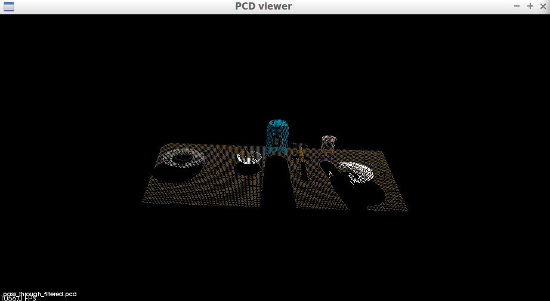
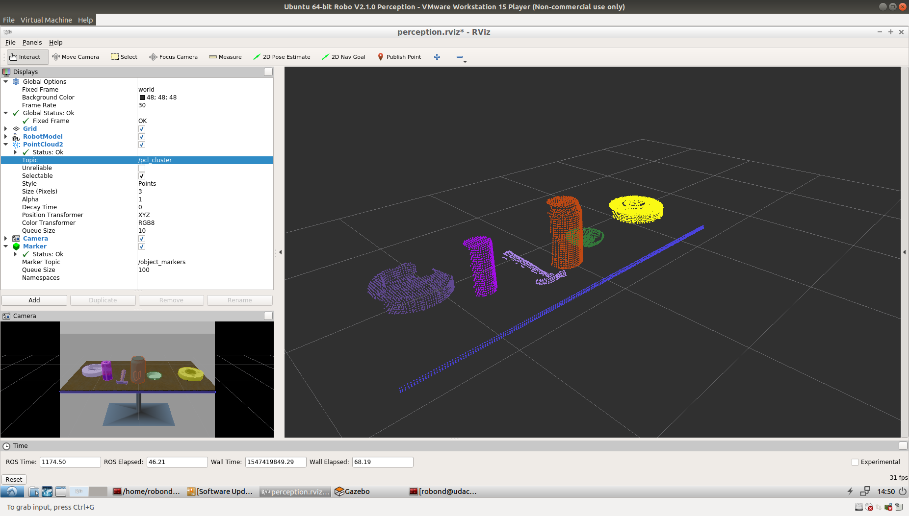

## Project: Perception Pick & Place
### Writeup Template: You can use this file as a template for your writeup if you want to submit it as a markdown file, but feel free to use some other method and submit a pdf if you prefer.

---

# Required Steps for a Passing Submission:
1. Extract features and train an SVM model on new objects (see `pick_list_*.yaml` in `/pr2_robot/config/` for the list of models you'll be trying to identify).
2. Write a ROS node and subscribe to `/pr2/world/points` topic. This topic contains noisy point cloud data that you must work with.
3. Use filtering and RANSAC plane fitting to isolate the objects of interest from the rest of the scene.
4. Apply Euclidean clustering to create separate clusters for individual items.
5. Perform object recognition on these objects and assign them labels (markers in RViz).
6. Calculate the centroid (average in x, y and z) of the set of points belonging to that each object.
7. Create ROS messages containing the details of each object (name, pick_pose, etc.) and write these messages out to `.yaml` files, one for each of the 3 scenarios (`test1-3.world` in `/pr2_robot/worlds/`).  [See the example `output.yaml` for details on what the output should look like.](https://github.com/udacity/RoboND-Perception-Project/blob/master/pr2_robot/config/output.yaml)  
8. Submit a link to your GitHub repo for the project or the Python code for your perception pipeline and your output `.yaml` files (3 `.yaml` files, one for each test world).  You must have correctly identified 100% of objects from `pick_list_1.yaml` for `test1.world`, 80% of items from `pick_list_2.yaml` for `test2.world` and 75% of items from `pick_list_3.yaml` in `test3.world`.
9. Congratulations!  Your Done!

# Extra Challenges: Complete the Pick & Place
7. To create a collision map, publish a point cloud to the `/pr2/3d_map/points` topic and make sure you change the `point_cloud_topic` to `/pr2/3d_map/points` in `sensors.yaml` in the `/pr2_robot/config/` directory. This topic is read by Moveit!, which uses this point cloud input to generate a collision map, allowing the robot to plan its trajectory.  Keep in mind that later when you go to pick up an object, you must first remove it from this point cloud so it is removed from the collision map!
8. Rotate the robot to generate collision map of table sides. This can be accomplished by publishing joint angle value(in radians) to `/pr2/world_joint_controller/command`
9. Rotate the robot back to its original state.
10. Create a ROS Client for the “pick_place_routine” rosservice.  In the required steps above, you already created the messages you need to use this service. Checkout the [PickPlace.srv](https://github.com/udacity/RoboND-Perception-Project/tree/master/pr2_robot/srv) file to find out what arguments you must pass to this service.
11. If everything was done correctly, when you pass the appropriate messages to the `pick_place_routine` service, the selected arm will perform pick and place operation and display trajectory in the RViz window
12. Place all the objects from your pick list in their respective dropoff box and you have completed the challenge!
13. Looking for a bigger challenge?  Load up the `challenge.world` scenario and see if you can get your perception pipeline working there!

## [Rubric](https://review.udacity.com/#!/rubrics/1067/view) Points
### Here I will consider the rubric points individually and describe how I addressed each point in my implementation.  

---
### Writeup / README

#### 1. Provide a Writeup / README that includes all the rubric points and how you addressed each one.  You can submit your writeup as markdown or pdf.  

You're reading it!

### Exercise 1, 2 and 3 pipeline implemented
#### 1. Complete Exercise 1 steps. Pipeline for filtering and RANSAC plane fitting implemented.
In this exercise several filters where introduced. Starting with a voxel filter, a pass through filter and an outlier filter, while the latter was not applied since the provided image did not contain any noise. Additionally the RANSAC plane fitting was applied. The application parameters were chosen by trial and error.
For the voxel filter a leave size of 0.01 were chosen and resulted in a downsampling as shown in the following figure.

The pass through filter depends on a filter axis. In this case the z axis in an interval between 0.6 and 1.1 was chosen. This results in a pointcloud of table and objects as shown in the following figure.

The extracting index for RANSAC plane fitting was set to 0.01 resulting in outliers(objects) and inliers(table) as shown in the following two figures.

The original pcl files can be viewed in */Exercise1/*.

#### 2. Complete Exercise 2 steps: Pipeline including clustering for segmentation implemented.  
In exercise 2 the steps above where included in a ros node and extended by a cluster segmentation. For the cluster segmentation a tolerance of 0.02, a minimal cluster size of 200 and a maximal cluster size of 25000 were chosen. The code can be reviewed in *Exercise2/segmentation.py*.
The resulting outlier, inlier and cluster are shown in the following figures.

#### 2. Complete Exercise 3 Steps.  Features extracted and SVM trained.  Object recognition implemented.
In exercise 3 features were extracted for the different objects. Therefore, orthogonal vectors to the objects surface and the color points were collected in histograms. The feature extraction was executed by randomly spawning the objects in front of the camera in an training environment (`roslaunch sensor_stick training.launch`).
While in the beginning the histogram routines in the feature.py were generating random distributions, they were changed accordingly. For the color information 32 bins in a range from 0 to 256 were chosen, while for the normals 16 bins in a range from -1 to 1 were chosen. Later on, the color space was changed from rgb to hsv for better performance and the number of object spawns were increased to 10 per object. The code can be viewed in *Project_Pick_and_Place/Scripts/Training/features.py* and *Project_Pick_and_Place/Scripts/Training/capture_features.py*

Feature extraction:

After the feature extraction a svm was trained. In a first step the *train_svm.py* file was adapted since there were changes in the sklearn versions. Here, I switched to `from sklearn.model_selection import cross_validate, KFold, cross_val_score, cross_val_predict`. The script was changed accordingly and can be viewed in *Project_Pick_and_Place/Scripts/Training/train_svm.py*.
Furthermore, the kernel was changed from linear to rbf.
The confusion matrices are displayed in the following figure.

Before I set up the pick and place environment, I was able to achieve a much better network. However I was not able to use the old model afterwards anymore and could not reproduce the results as good as before, even not by increasing the number of spawns up to 100. Nevertheless, most objects could be labeled correctly:

### Pick and Place Setup

#### 1. For all three tabletop setups (`test*.world`), perform object recognition, then read in respective pick list (`pick_list_*.yaml`). Next construct the messages that would comprise a valid `PickPlace` request output them to `.yaml` format.

For the pick and place setup the training of the svm model was done in the old training environment of exercise 3. Therefore only the model list was adapted. To achieve better results the number of spawns per object was increased to 250. Additionally, the bins for the color histograms were changed to 256. rbf showed in all tests better results than the linear kernel.

Even though I achieved a very high number of hits with other tests, I only got sufficient results by changing the bins amount to 256.

For the *project_template.py* (can be viewed in *Project_Pick_and_Place/Scripts/Pick_and_Place/*) the code of exercise 3 was copied and extended by an outlier filter with k mean of 20 and a scale factor of 0.001. The leaf size for the voxel was reduced to 0.003 and the pass through filter was extended by a second pass through filter in direction of the y axis. This was done to avoid identifying the baskets as objects. While for world 1 and 2 I could achieve a 100% recognition I could in world 3 only cover 75% of the objects since 2 were identified as glue.
The labeling can be seen in the following.
World 1:

World 2:

World 3:

Objects, Table and Clustering can be seen in the following figures.

The generated output files of the centroid calculation can be found in  */Project_Pick_and_Place/*. the pr2_mover function only is executed if there are detected objects. The mover function itself reads in the dropbox and object lists files and compares them to the list of detected objects. If they are consistent the center positions, the arm to pick up the object and the place position are added to the output_list. If the whole list is checked, the output file is generated.

**Spend some time at the end to discuss your code, what techniques you used, what worked and why, where the implementation might fail and how you might improve it if you were going to pursue this project further.**

The most restrictions came from the environment. A first attempt only could be resolved by setting up the virtual machine from scratch. Before the frames were not connected.
It always took several approaches to get the environment up and running. Either RViz or Gazebo did not start :-(. When it was up and running it sadly consumed to much cpu and was really slow. I assume this is the reason why the robot could not pick up the objects correctly or crushed all the time or did not move the arms to the side or...
Here is a picture of the robot partying hard and keeping me up at night:

Sometimes the robot started slamming the table, forcing a restart (or trial of restarts) of the environment. This resulted in long trail and error runs. It seems that most students had problems with the resources and I read that someone started using AWS cloud, which could be an option for future problems of that kind. Overall this project was quite exhausting despite the interesting content.
